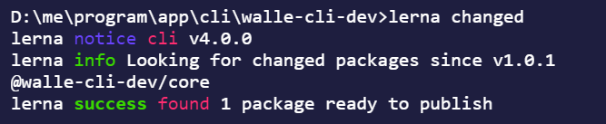

### 创建 lerna 项目

1. 全局安装 lerna 

   ```js
   npm install -g lerna
   ```

2. 创建 walle-cli-dev 目录，初始化 npm 项目

   ```js
   npm init -y
   ```

3. 初始化 lerna 项目

   ```
   lerna init
   ```

4. 更改 lerna 版本，和项cwd目版本一致

   

5. 初始化 git 仓库，因为 lerna 是基于 git + npm 的，所以必须使用 git 托管代码

### 常用命令

1. `lerna create` 创建包

   ```bash
   lerna create core 
   lerna create utils
   ```

   **注意**

   这个文件的 `@walle-cli-dev` 表示组织 需要先在 `npmjs.com`  添加组织，可以理解为 命名空间，直接包名是 core 的话肯定发布不了的

   

   

2. `lerna add ` 安装依赖

   ```bash
   lerna add <package>[@version] [--dev] [--exact] [--peer]
   
   # 为所有包安装 package 依赖
   lerna add package
   # 只为 core 包安装 package 依赖
   lerna add package packages/core
   ```

   > Add local or remote `package` as dependency to packages in the current Lerna repo. Note that only a single package can be added at a time compared to `yarn add` or `npm install`
   >
   > 安装依赖： 和 `yarn add` 或者 `npm install` 的区别是 `yarn add` 或者 `npm install` 只能一次为一个包安装依赖

   

3. `lerna bootstrap` 安装 `dependencies` 里面的依赖

   **注意和 lerna add 的区别**

   当我们通过 `lerna add package` 为所有包安装了依赖,然后用 `lerna clean` 清除了 `node_modules`，但是 `leran clean` 不会清除 `dependencies` 里面的依赖，再次使用 `lerna add package` 的时候：

   

   这次需要使用 `lerna bootstrap`

   **lerna bootstrap 就是为项目的所有的包安装 dependencies 里面声明的所有依赖**

   **lerna add 为项目所有的包安装 新的依赖**

   

4. `lerna link` 安装项目内的依赖

   **比如：**

   我们创建了一个脚手架项目 `walle-cli-dev` 里面有两个包：

   `packages/core`

   `packages/utils`

   我们要在 `core` 包中依赖 `utils` 包，这时：

   在 `core` 包里面的 `package.json` 文件中

   ```json
   "dependencies": {
       "@walle-cli-dev/utils": "1.0.0"
    }
   ```

   执行 `lerna link`

   

   注意看这里远程的包并没有在 `node_modules` 出现， 只是执行了依赖本地的包，注意和 `lerna bootstrap` 的区别

   lerna bootstrap 就是为项目的所有的包安装 dependencies 里面声明的所有依赖

   

5. `lerna clean` 清除依赖

   **注意**

   只会清空 node_modules，不会删除 `dependencies` 中的依赖


6. `lerna exec` 执行 `bash` 命令

   ```bash
   # 在 packages 下的所有包下面执行 rm -rf node_modules
   lerna exec -- rm -rf ./node_modules  # runs the command in all packages
   lerna exec -- rm -rf node_modules
   
   # 在 @walle-cli-dev/core 包下面执行 ls -la
   lerna exec --scope @walle-cli-dev/core -- ls -la
   ```

   > Execute an arbitrary command in each package


7. `lerna run` 执行 `npm` 命令

   ```bash
   lerna run <script> -- [..args] # runs npm run my-script in all packages that have it
   ```

   > Run an npm script in each package that contains that script

   参考 `lerna exec` 命令


### 发布项目 

**发布项目之前需要 初始化 git 仓库，创建远程仓库**

**否则以下命令会报错，根据提示向下进行即可**

1. `lerna changed`

   可以查看 那些包有更改将会被发布

   

   

2. `lerna diff`

   可以查看两次距上次 `commit` 具体更改了什么

   

   **注意：**这些命令都是在 `packages` 下有更改才会检测到，当我尝试修改 `README.md` 文件时，这些命令不会去管它

   

3. `lerna version` 提升版本号

   执行 `lerna version` 会发生：

   

   并且在 `github` 上：

   

   当 `packages` 下的内容有更改时，需要先 `commit` 才能执行 `lerna version

   

   

   **这里当我们选 y 时：**

   **执行流程：**

   `lerna version` -> 创建新的版本号 --> 修改 `package.json` 的 `version` --> 推送 `tag(version)` 和 修改 到远程仓库

   注意我们 `packages` 下的代码修改后只用 `commit` ,执行 `lerna version` 会 push 代码

   **选 y** 会执行上面流程 但是会影响后面的 `publish` 因为这里已经提升了版本，并推送了 `version` 和 代码，执行 `publish` 的时候就会认为版本没有变化：

   

   **选 n** 就什么都不执行

   

4. `lerna publish` 发布

   `lerna publih` 的执行流程和 `lerna version` 差不多，`lerna publish` 多了一个发布到 `npmjs.com` 上面的一个步骤

   **执行 `lerna publish` 之前：**

   发布到组织 @walle-cli-dev 下面的包需要在 package.json 文件中添加配置：

   ```json
   // 设置发布为 公开 包
   // 不设置会默认发布为私有包 会提示：You must sign up for private packages
   "publishConfig": {
       "access": "public"
    }
   ```


### 遇到问题

```bash
lerna --help
# for example
lerna publish --help
```
